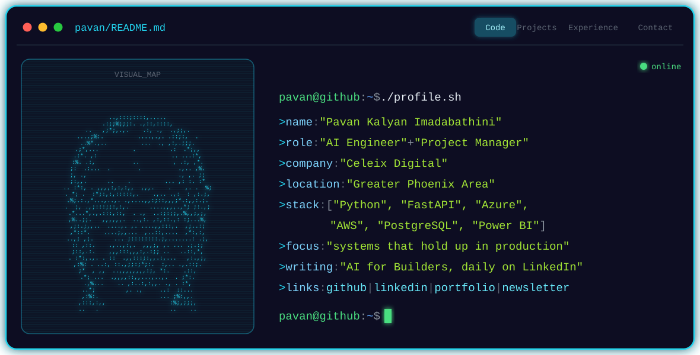

**Daily AI insights for builders | AI Engineer & Project Manager @ Celeix Digital | Python, Azure, AWS**

## About me

I'm a software engineer and project manager who builds backend systems that hold up in production: Python APIs, cloud platforms, and data foundations teams can trust.

Right now I'm at **Celeix Digital**, leading two programs:

- **Max Shipping**: an AI-assisted vessel operations platform. It replaces a chaotic shared inbox with a vessel-centric workspace for shipping agents. AI classifies, drafts, and flags risks, while humans stay in control.
- **PCCA**: an Azure Fabric data foundation for the Port of Corpus Christi Authority. Medallion architecture that consolidates Tidalis, AIS, Dock Closures and JD Edwards into one governed layer.

I also write **"AI for Builders"**, a daily LinkedIn newsletter (222 subscribers) with one practical AI update every morning.

## Tech I reach for

## My activity

My daily AI digest workflow commits every morning, so the streak stays alive all week.

## How often I ship

- 📬 **Every morning**: an automation collects the latest AI news and drafts that day's LinkedIn post
- ✍️ **Every day**: I publish one practical "AI for Builders" post on LinkedIn
- 🛠️ **Ongoing**: steady commits across the projects below

## Featured projects

| Project | What it is |
|---|---|
| [ai-daily-digest](https://github.com/pavankalyanimadabathini/ai-daily-digest) | Scheduled pipeline that turns the latest AI news into LinkedIn post drafts. Zero API keys needed. |
| [agent-demos](https://github.com/pavankalyanimadabathini/agent-demos) | Small, runnable AI agent demos: reflection loops, a research team, and a ReAct tool-using agent. |
| [pm-toolkit](https://github.com/pavankalyanimadabathini/pm-toolkit) | CLI toolkit for PMs and POs: RICE scoring, PRD generator, user stories, roadmaps. |
| [data-pipeline-starter](https://github.com/pavankalyanimadabathini/data-pipeline-starter) | Modern data stack starter: dbt + DuckDB, staging to marts, tested end to end. |
| [Portfolio site](https://pavan-kalyan-imadabathini.vercel.app) | My personal portfolio, built with Next.js. |

## Reach me

- 💼 [LinkedIn](https://www.linkedin.com/in/pavan-kalyan-imadabathini)
- 📰 ["AI for Builders" newsletter](https://www.linkedin.com/newsletters/7509140255745384448/)
- 🌐 [Portfolio](https://pavan-kalyan-imadabathini.vercel.app)
